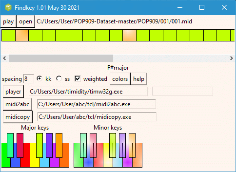
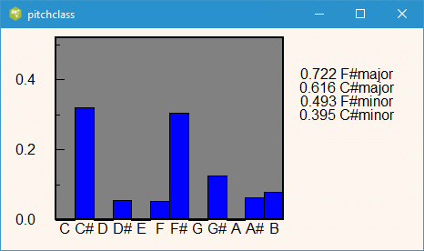
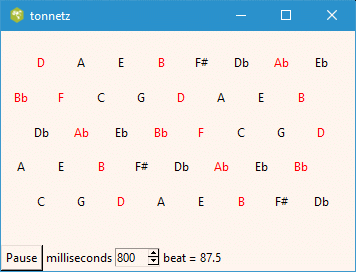

##  KeyMap

The program uses the local pitch class histogram to trace the evolution of the
key in a midi music file. It is based on the Krumhansl-Kessler algorithm. The
output is a color coded strip representing the music file, where the colors
are based on Craig Sapp's scheme published in his thesis and applied in his
humdrum application called mkeyscape. The program runs on all platforms,
(Windows, Linux and OS); however, the system requires the Tcl/Tk 8.5 or higher
to be present. It also requires external executables midi2abc, midicopy which
are part of the abcMIDI package. A midiplayer is also useful.

Here is an example of the user interface using a sample file from the
published Pop-song dataset by Ziyu Wang and many others. The top strip shows
the local key in blocks of 8 beats, for the give midi file. The key is mainly
F# major but switches to Bb minor occasionally. Clicking on one of the color
coded blocks in the upper strip, produces the histogram shown below.

Right clicking on one of the color coded blocks, will animate a sequence of
Tonnetz diagrams for the notes in that time interval. (T. Bergstrom, K.
Karahalios and J. C. Hart, (2007) Isochords: Visualizing Structure in Music).
The Tonnetz diagram lays out the notes that are harmonically close. Thus
neighbouring notes are a fifth or a third apart. A triad of notes forms a
compact triangle.

To reduce the clutter in an individual diagram, the time interval
corresponding to the block is segmented into units corresponding to the size
of a sixteenth note. The program cycles through each of the units displaying
the active notes. Notes that just turned on, are shown in purple. If the notes
extend into adjacent units they are displayed in red.

The speed of the animation is determined by the millisecond value in the
spinbox. This value determines how long the program dwells in each of the 1/16
note time units.

>  
>  Computational Methods for the Analysis of Musical Structure. Craig Sapp.
> https://stacks.stanford.edu/file/druid:br237mp4161/dissertation-submitted-
> augmented.pdf  
>  POP909: A Pop-song Dataset for Music Arrangement Generation. Ziyu Wang et.
> al. https://arxiv.org/abs/2008.07142  
>  Cognitive Foundations of Musical Pitch. Carol Krumhansl. Oxford Psychology
> Series, No 17, pages 81-96.

